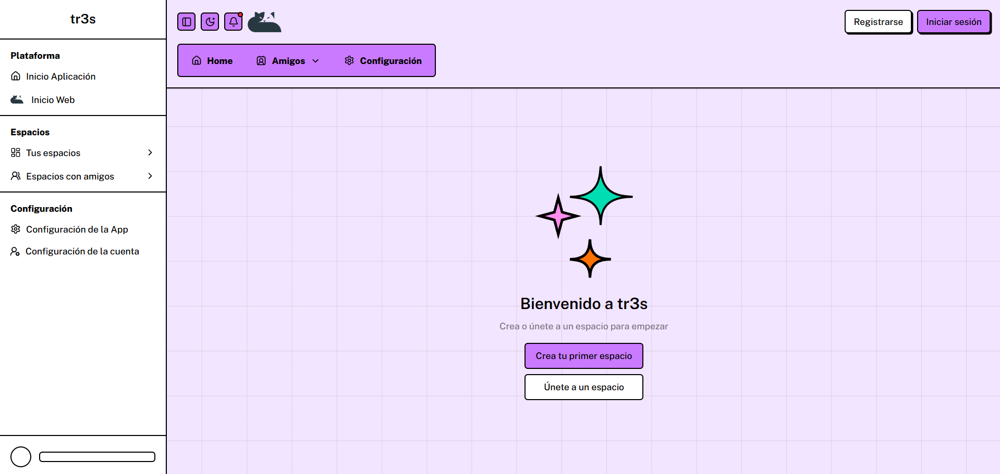
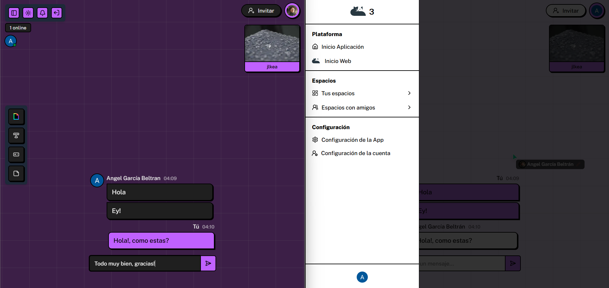
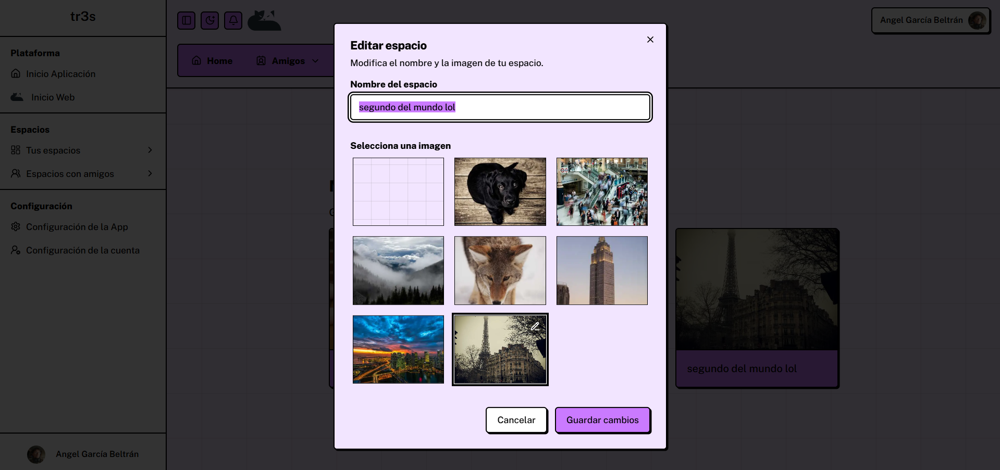
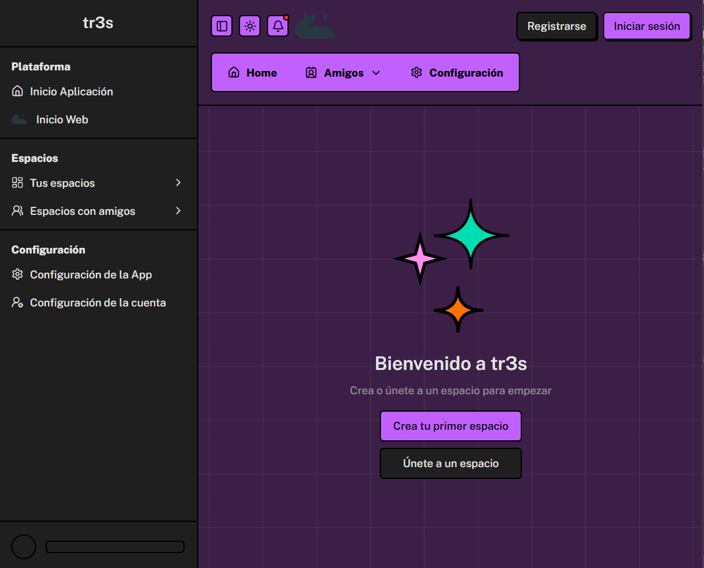
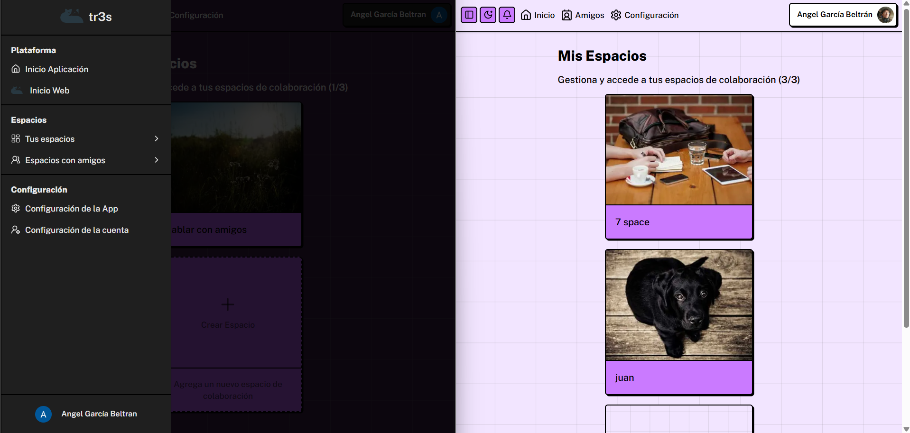
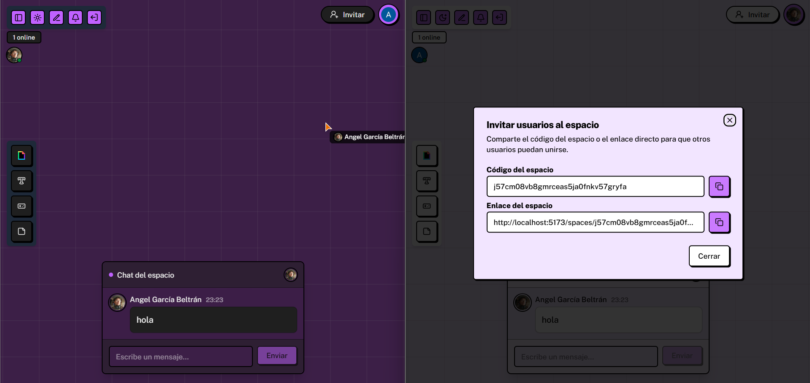

# tr3s

**tr3s** is a real-time web application created as a Final Degree Project (TFG) for the "_Ciclo de Desarrollo de Aplicaciones Multiplataforma_", in Spain, Madrid.



The project explores forms of digital communication beyond traditional messaging, focusing on shared presence. Inspired by platforms like [here.fm](https://here.fm/), **tr3s** offers interactive "_spaces_" where users can chat, share images, and co-exist digitally by seeing other users' cursors and activity in real-time.

The interface adopts a **NeoBrutalist** aesthetic, featuring a **responsive** design and an automatic **dark mode** based on system preferences.

## Key Features

- **Real-Time Spaces:** Create and manage interactive & real-time rooms.

- **Shared Presence**:
  - **Live Cursors:** View the mouse pointers of all users in the _space_, smoothed with Framer Motion.

  - **Typing Indicator:** Shows who is currently typing in the chat.

- **Chat:** An instant messaging system for each space.

- **Secure Authentication:** Complete user management (signup, login, profiles) powered by **Clerk**, including Google OAuth.

- **NeoBrutalist Design:** A distinctive interface built with Tailwind CSS and customized shadcn/ui components.

- **Dark Mode:** Automatic theme detection with a manual toggle.

## Tech Stack & Architecture

The project is structured as a monorepo (frontend and convex).

- **Runtime:** Bun (runtime, package manager, and bundler).
- **Frontend (SPA):**
  - **Framework:** React 19
  - **Bundler:** Vite
  - **Routing:** Tanstack Router
  - **Styling:** Tailwind CSS
  - **UI Components:** shadcn/ui
  - **Animation:** Framer Motion
- **Backend (BaaS):**
  - **Backend & Database:** Convex. Acts as the serverless backend and real-time SQL database. It provides real-time reactivity via WebSockets. `Queries`, `Mutations`, and `Actions` are all written in TypeScript.
  - **HTTP Endpoints:** Hono. Runs on Convex to handle incoming webhooks (e.g., user synchronization from Clerk).
- **Authentication:**
  - **User Management:** Clerk (frontend and backend).
- **Validation:**
  - **Zod:** Used for schema and data validation, in each communication of the front-end & back-end.

### Core Architecture Flow

1. **Client (React):** The frontend subscribes to Convex queries.
2. **Communication (WebSocket):** Convex uses WebSockets to push real-time updates to the client whenever data changes, eliminating the need for polling.
3. **Backend (Convex):** Manages all business logic, database state (underlying MySQL/PostgreSQL), and ACID transactions.
4. **Authentication (Clerk):** Clerk handles client-side sessions. When a user signs up or updates, Clerk sends a webhook to an HTTP endpoint.
5. **Webhooks (Hono):** A Hono server, running on Convex, receives this webhook, validates it (using svix and zod), and invokes a Convex action or mutation to synchronize the tr3s database with Clerk.

## Showcase



<details>
  <summary>See all</summary>









</details>

## Running Locally

### Prerequisites

- Install [Bun](https://bun.com/)
- You must create a project on [Convex](https://www.convex.dev/)
- You must create an application on [Clerk](https://clerk.com/)

### Installation

1.  **Clone the repository:**

    ```bash
    git clone https://github.com/angelurano/tr3s
    cd tr3s
    ```

2.  **Install all dependencies:**
    Since the project is structured as a monorepo without a package manager workspace config, you must install dependencies in both the root directory and the `frontend` subdirectory:

    ```bash
    # Install root dependencies (Convex, linting, etc.)
    bun install

    # Install frontend dependencies (Vite, React, UI components)
    bun install --cwd frontend
    ```

3.  **Configure Environment Variables:**
    You will need to set up separate `.env.local` files for the backend and the frontend to avoid configuration conflicts (like Convex CLI complaining about duplicate variables).

    For local development, make sure to use your Clerk **Development/Test keys** (which start with `pk_test_` and `sk_test_`).
    - **Root `.env.local` (Backend / Convex):**
      Create a `.env.local` file in the root of the project:

      ```txt
      # Will be automatically configured by running 'bun run dev:server' or manually:
      CONVEX_DEPLOYMENT=dev:your-deployment-name
      CONVEX_URL=https://your-project.convex.cloud

      # Clerk Backend config
      CLERK_SECRET_KEY=sk_test_...
      VITE_CLERK_FRONTEND_API_URL=https://your-app.clerk.accounts.dev
      ```

    - **Frontend `frontend/.env.local` (Vite Frontend):**
      Create a `.env.local` file inside the `frontend/` directory:
      ```txt
      VITE_CONVEX_URL=https://your-project.convex.cloud
      VITE_CLERK_PUBLISHABLE_KEY=pk_test_...
      ```

4.  Development
    You will need two terminals running simultaneously.
    1. **Terminal 1 (Convex Backend):** Starts the Convex development server. This will watch your /convex folder and sync your schema and functions.

       ```bash
       bun run dev:server
       ```

    2. **Terminal 2 (Vite Frontend):** Starts the Vite development server for the React SPA.
       ```bash
       bun run dev:frontend
       ```

    <br>

The application will be available at [http://localhost:5173](http://localhost:5173) (or the port specified by Vite).
